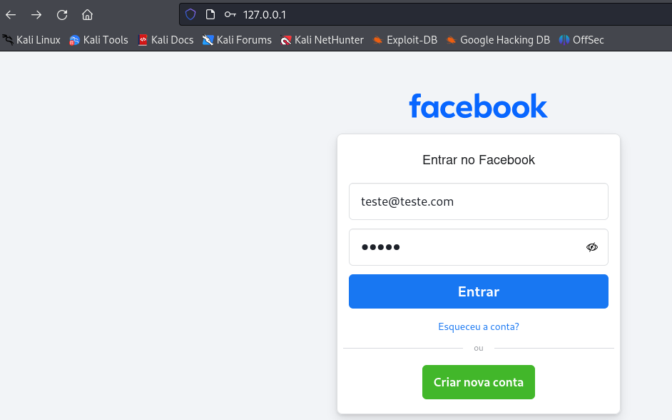

# Phishing

Phishing e Engenharia Social com SEToolkit: O Social-Engineer Toolkit
(SEToolkit) é empregado para realizar ataques de phishing e outras formas de
engenharia social, simulando páginas de login de serviços conhecidos para capturar
credenciais. Esta ferramenta é fundamental para criar cenários de ataque
personalizados e efetivos.

Neste cenário, utilizamos o SET para um ataque de phishing clonando a página
facebook.com para capturar o email e senha:

Configurando para clonar a página:

Digitando o email e senha:

Redirecionado para a página verdadeira:

Email e senha capturados:

